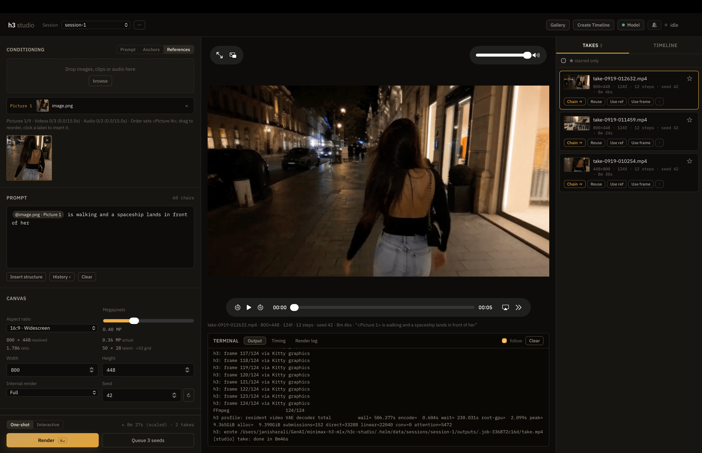

# h3 studio

**A local web control surface for [h3.c](https://github.com/janishar/h3.c)** — native
MiniMax-H3 video/audio inference on Apple Silicon.

h3 studio is a Go stdlib-only web server (no JS build step, no third-party Go
dependencies) that drives the `h3` binary: it builds the CLI
arguments, runs one-shot or interactive sessions, manages references and
anchors, queues renders, chains shots together, and surfaces live profiling
output — all from a browser tab, with nothing sent off your machine.

[](go.mod)
[](#requirements)
[](LICENSE)
[](CONTRIBUTING.md)

<p align="center">
  
</p>

## Motivation

Video diffusion on Apple Silicon is underserved. ComfyUI has no first-class
MLX support, so it's stuck running these models through PyTorch's `mps`
backend — which is slow for this workload and holds onto a lot more unified
memory than the model actually needs, on hardware where that memory is
shared with everything else running. h3.c takes a different approach: it's a
native Metal implementation with no PyTorch/MLX in the loop, built
specifically for MiniMax-H3 on Apple GPUs. h3 studio exists to make that
engine usable as a real tool — a browser UI over the CLI — without pulling in
a Python stack or a node-graph app to get there.

## Table of contents

- [Motivation](#motivation)
- [Requirements](#requirements)
- [Installation](#installation)
- [Downloading the weights (deduplicated)](#downloading-the-weights-deduplicated)
- [Usage](#usage)
- [Features](#features)
- [Sessions and state](#sessions-and-state)
- [Notes for an external drive](#notes-for-an-external-drive)
- [Security](#security)
- [Limits](#limits)
- [Contributing](#contributing)
- [License](#license)
- [Acknowledgments](#acknowledgments)

## Requirements

### Hardware and OS

- **Apple Silicon Mac.** h3.c uses native Metal, MetalPerformanceShaders,
  MetalPerformanceShadersGraph, and Accelerate — it does not run on Intel or
  on non-Apple GPUs. M3-class and M5-class chips are the tested targets; M5
  additionally gets native Metal 4/TensorOps fast paths (int8 MLP, quantized
  attention) that M3 falls back from automatically.
- **macOS** recent enough for the Metal 4/TensorOps frameworks (macOS 26.x was
  used for development). Command Line Tools (`clang`) are sufficient to build
  h3.c — a full Xcode install is not required.
- **Unified memory:** validated on a 64 GB MacBook Pro (M5). Lower-memory
  Macs can still run smaller canvases and `--ssd-streaming`, but should
  expect to tune the model flags described in [`h3c/README.md`](h3c/README.md).
- **Disk:** the full MiniMax-H3 checkpoint (both pipelines) is about **196 GB**
  — `FL2VA` (~62 GB) for prompt/first-last-frame generation and `Ref2VA`
  (~134 GB) for reference-conditioned generation. Both pipelines duplicate
  most of their weights, so this can be brought down to **~66 GB**; see
  [Downloading the weights (deduplicated)](#downloading-the-weights-deduplicated).
  Fast local storage (internal NVMe) is recommended; see
  [Notes for an external drive](#notes-for-an-external-drive) if the
  checkpoint lives on external storage.

### Toolchain

- **Go 1.27+** to build h3 studio itself (`go.mod` pins `go 1.27`).
- **Command Line Tools / clang** to build the `h3` binary (h3.c's `Makefile`
  links `Foundation`, `Metal`, `MetalPerformanceShaders`,
  `MetalPerformanceShadersGraph`, and `Accelerate`).
- **FFmpeg and FFprobe on `PATH`** — required by h3.c for decoding reference
  media and encoding MP4 output (`H3_FFMPEG` / `H3_FFPROBE` env vars can point
  at explicit executables instead). Install with `brew install ffmpeg`.
- **git** with submodule support — this repo vendors h3.c as the `h3c`
  submodule.

### Model

h3 studio does not download or convert the model itself; point it at a local
MiniMax-H3 checkpoint directory prepared for h3.c. The published weights are
[`MiniMaxAI/MiniMax-H3`](https://huggingface.co/MiniMaxAI/MiniMax-H3) on
Hugging Face, laid out as an `FL2VA/` and a `Ref2VA/` pipeline directory (each
with `text_encoder/`, `tokenizer/`, `processor/`, `transformer/`,
`video_vae/`, `audio_vae/`, and a `model_index.json`). Review that model's own
license and usage terms on Hugging Face before downloading — it is not
covered by this repository's license (see [License](#license)).

## Installation

### 1. Clone with the h3.c submodule

```bash
git clone --recurse-submodules https://github.com/janishar/h3c-studio.git
cd h3c-studio
# if already cloned without --recurse-submodules:
git submodule update --init --recursive
```

### 2. Build the h3 binary (h3.c)

```bash
cd h3c
make -j8
cd ..
```

This produces `h3c/h3`. See [h3c/README.md](h3c/README.md) for the full CLI
reference, sampler/preset tuning, and the environment variables used for
performance diagnosis.

### 3. Download the model

```bash
hf download MiniMaxAI/MiniMax-H3 --local-dir /path/to/MiniMax-H3
```

Budget ~196 GB of free disk space. You can substitute any Hugging Face
download method (`hf` CLI, `git lfs clone`, etc.) as long as the resulting
directory keeps the `FL2VA/` and `Ref2VA/` layout above. To download only
~66 GB instead, see [Downloading the weights (deduplicated)](#downloading-the-weights-deduplicated)
below before running this step.

### 4. Build h3 studio

```bash
GOCACHE=$(pwd)/.gocache go build -o ./dist/h3studio .
```

The web UI is embedded in the binary, so `dist/h3studio` runs on its own.

## Downloading the weights (deduplicated)

`MiniMaxAI/MiniMax-H3` ships two variants, `Ref2VA` and `FL2VA`, which share
everything except the transformer. Downloading both in full costs ~144 GB.
Verified by SHA256: `video_vae`, `audio_vae`, `tokenizer`, `processor` and
`text_encoder` are byte-identical across the two; only the transformer shards
differ (same sizes, different hashes — a consistent sharding config, not
shared weights).

Fetching the shared components once and symlinking them brings the download
down to **~66 GB**.

### 1. Download Ref2VA in full

```bash
hf download MiniMaxAI/MiniMax-H3 --local-dir ./MiniMax-H3 \
  --include "Ref2VA/*"
```

### 2. Symlink the shared components into FL2VA

```bash
cd MiniMax-H3
mkdir -p FL2VA
ln -s ../Ref2VA/text_encoder FL2VA/text_encoder
ln -s ../Ref2VA/video_vae    FL2VA/video_vae
ln -s ../Ref2VA/audio_vae    FL2VA/audio_vae
ln -s ../Ref2VA/tokenizer    FL2VA/tokenizer
ln -s ../Ref2VA/processor    FL2VA/processor
cd ..
```

### 3. Download only the FL2VA transformer

```bash
hf download MiniMaxAI/MiniMax-H3 --local-dir ./MiniMax-H3 \
  --include "FL2VA/transformer/*" \
  --include "FL2VA/model_index.json"
```

### 4. Verify

```bash
ls -la MiniMax-H3/FL2VA/          # expect five symlinks → ../Ref2VA/...
du -sh MiniMax-H3                 # expect ~66 GB
./h3 --info -d ./MiniMax-H3       # confirms h3.c accepts the tree
```

> **Note:** `hf download` can overwrite symlinks when writing into a directory
> that already contains them. If step 3 replaces them, download the transformer
> to a scratch directory and move it into place, then recreate the symlinks.

> **Note:** symlinks require the weights to live on a filesystem that supports
> them. APFS and ext4 are fine; exFAT is not.

## Usage

### Running

```bash
./dist/h3studio --h3 ./h3c/h3 --model /path/to/MiniMax-H3
```

Open http://127.0.0.1:8710. The paths are remembered in `sessions/h3.json` and
`sessions/model.json`, so later runs can omit them; a flag or environment
variable always wins over the remembered value.

For front-end work, add `--dev` to serve `static/` from disk without caching —
edit a file and refresh the browser.

**There is no authentication** — see [Security](#security) before binding to
anything other than `127.0.0.1`.

| Flag | Default | Description |
| --- | --- | --- |
| `--h3` | `$H3STUDIO_H3`, else last used | Path to the built `h3` binary. |
| `--model` | `$H3STUDIO_MODEL`, else last used | Path to the MiniMax-H3 checkpoint directory. |
| `--host` | `127.0.0.1` | Bind address. A warning is printed for anything but loopback. |
| `--port` | `8710` | Bind port. |
| `--dev` | `false` | Serve `static/` from disk with `Cache-Control: no-store`. |
| `--allow-shell` | `false` | Enable the `$` shell terminal and changing the h3 binary from the browser. |
| `--allow-host` | *(none)* | Extra `Host` names to accept (comma-separated). IP addresses and `localhost` are always accepted. |
| `--root` | next to the binary, or the current directory | Directory holding `sessions/`. |

Choose **One-shot** or **Interactive** in the render bar at the bottom of the
left pane. Interactive h3.c starts when you click **Load h3.c** or send the
first interactive render, so starting the studio itself never loads the model.
**⌘/Ctrl+Enter** renders from anywhere; **⇧⌘/Ctrl+Enter** queues three seeds.

### Run from VS Code

`.vscode/launch.json` ships ready-made configurations for the Go extension's
Run & Debug panel (`Cmd+Shift+D`, pick one, `F5`):

| Configuration | What it does |
| --- | --- |
| **h3 studio (dev - static from disk)** | Runs from source with `--dev` on `127.0.0.1:8710` — the everyday development config. |
| **h3 studio (custom paths)** | Same, but prompts for the `--h3` and `--model` paths. |
| **h3 studio (debug - source)** | Runs from source with the embedded UI, for stepping through the server. |
| **h3 studio (LAN - 0.0.0.0, no auth)** | Binds to all interfaces and prompts for the host name other machines use — see [Security](#security). |
| **h3 studio (dist build)** | Builds and runs `dist/h3studio` under the debugger. |
| **h3 studio** | Runs it under helmstudio's platform API and attaches the debugger — see [Running under helmstudio](#running-under-helmstudio). |

All but "custom paths" have `--model` hardcoded to a sample path — edit it in
`.vscode/launch.json`, or use "custom paths". `.vscode/tasks.json` adds
**build: h3studio (dist)**, **test: go (race)** and **test: canvas.js (node)**,
and the three below.

### Running under helmstudio

The configurations above run the server on its own, which is the fastest way
to work on it. To run it the way a user does — with sessions, assets and the
gallery going through helmstudio, and the page taking helm-css, the theme and
this studio's hue from the `/helm/` proxy — run it under `helm dev`:

```bash
H3_MODEL=/path/to/MiniMax-H3 bash scripts/run.sh
bash scripts/run.sh stop
```

`helm` comes from [helmstudio's installer][helm-install] and needs no
helmstudio checkout; `H3_MODEL` points at a MiniMax-H3 directory you already
have, which is linked read-only rather than downloaded. `HELM` names a
particular helm if you do not want the one on `PATH`. Everything the studio
keeps goes to `.helm/` beside the repository, which is gitignored.

**`helm dev` runs no build steps** — the checkout is yours — so the script
builds `dist/h3studio` first. A stale binary is the difference between the
`/helm/` proxy answering and returning 404.

To debug it there, set `H3_DLV` to a port:

```bash
H3_MODEL=/path/to/MiniMax-H3 H3_DLV=2345 bash scripts/run.sh
```

`helm dev` hands the studio a restricted environment, and the manifest names
`./dist/h3studio` rather than a debugger, so the binary moves aside and that
name becomes a shim running it under [Delve][dlv], which listens on the port.
It is built with `-N -l` so stepping follows the source, and Delve is given
`--continue` so the studio starts rather than waiting for a client. A run
without `H3_DLV` builds a normal binary over the shim again.

From VS Code the same three are **run: h3 studio**, **debug: h3 studio** and
**stop: h3 studio**, and the *h3 studio* launch configuration runs the debug
task and attaches to `127.0.0.1:2345`.

[dlv]: https://github.com/go-delve/delve

[helm-install]: https://github.com/janishar/helmstudio#getting-started

## Features

**Reference ordering is explicit.** References are numbered `Picture 1`,
`Picture 2` in list order, and you drag to reorder. Since filenames mean
nothing to the model and position is what it reads, getting this wrong
silently produces the wrong shot.

**Three conditioning modes.** **Prompt** (text only), **Anchors** (first/last
frame, FL2VA) and **References** (ordered Ref2VA images, clips and audio). Each
mode keeps its own inputs, and only the active one is sent to h3. References
are disabled with an explanation when the model has no `Ref2VA/` pipeline.

**Illegal settings are caught before launch.** The server validates every
render — canvas on the 32-pixel grid and under 768×1344, the 5+17n frame grid,
reference counts and durations, inputs that actually exist in the session —
and the same errors show in the render bar as you edit. **Command** shows the
exact argv (or REPL commands) the server will run, built by the same code that
runs it.

**Canvas by aspect ratio.** Pick 16:9, 9:16, 1:1, 4:3, 3:4, 3:2, 2:3, 21:9,
**Match input** (follows the first anchor or image reference) or Custom, then
drag **Megapixels**; the studio solves the closest legal size and shows the
latent size. A warning appears when an anchor's aspect would be stretched.

**One-shot and interactive rendering.** One-shot spawns a fresh `h3` process
per render. Interactive mode keeps `h3` resident, so repeated **Send to h3.c**
renders skip the model load and only pay for re-encoding the changed
prompt/conditioning. You can also type commands and prompts at the `h3>`
console; a queued studio render waits for a manual prompt to finish first, and
each render's output is tracked in its own directory so the two never get
mixed up.

**Continue generation from any take.** Every take carries ways to feed
itself back into the next render, so a shot can grow out of whatever you
already generated instead of starting cold:

- **Chain →** extracts the take's last frame, switches the form to anchor
  mode, and sets that frame as the *first* frame of the next shot (clearing
  any existing last-frame anchor) — the fastest way to keep a sequence moving
  forward, e.g. a stationary shot to a walking shot.
- **Use Frame** extracts the take's last frame and adds it as a reference
  instead of forcing a mode switch: in anchor mode it fills whichever of
  first/last is still empty, in Reference mode it's appended as the next
  `Picture N`. Use this when you want the frame as an Ref2VA reference
  alongside others, not as a hard first/last anchor.
- **Use ref** copies the take's whole output video into the session and adds
  it as a `Video N` reference (max 3), for continuing motion/subject
  continuity from the clip itself rather than a single frame.
- The **⋮** menu adds **First frame → input**, **Use audio** (extracts the
  soundtrack as an audio reference), **Previews (N)**, **Add to compare**,
  **Download** and **Delete**.

All of these copy the source file into the session's `inputs/` directory first,
since renders only ever read references from there — takes themselves live in
`outputs/` and are never read back directly.

**Timeline.** Combine multiple takes from a session into a single output
video from the Timeline panel — pick clips, order them, and export. Below,
two FL2VA takes from the same session are combined with the Timeline feature
into one continuous shot:

<table>
<tr>
<td width="260" valign="top">

<video src="docs/assets/timeline-1.mp4" controls width="240">
  Your browser does not support embedded video —
  <a href="docs/assets/timeline-1.mp4">download the clip</a> instead.
</video>

https://github.com/user-attachments/assets/d7991a0b-a7eb-44d0-a7d4-5fdf9392eebe

</td>
<td valign="top">

**Part 1** — first frame: uploaded `image.png` (right)

*"She walks away down a rainy boulevard, then turns to face camera."*
480×864 · 124f · steps 8 · seed `989663098`

**Part 2** — first frame: Part 1's last frame, pulled in with **Use Frame**
*"She smiles, waves, and says 'Hi!' continuing the same shot."*
480×864 · 124f · steps 8 · seed `989663098` (same seed kept for continuity)

Both takes: FL2VA, one-shot mode, combined with the Timeline feature.

</td>
</tr>
</table>

**Reproducibility.** Every render writes a `.json` sidecar next to the MP4
with the full parameter set, the exact argv, an ffprobe summary, the profile
and the saved previews. **Reuse** restores a past take into the form and
**History** in the prompt block brings back earlier prompts. Nothing depends
on you remembering what you did.

**Queue and seed comparison.** One render at a time — one GPU. **Queue 3
seeds** submits the same setup with three random seeds; when they finish, the
viewer opens a synced grid of the three with a **Keep** (star) button on each.
Any two takes can also be compared with an **A/B wipe**, and **★ starred
only** filters the take list.

**Progress you can read.** The running card shows a Load → Encode → Denoise
→ Decode → MP4 stepper, elapsed time and an ETA (measured per denoise step, or
estimated from this session's earlier takes with the same settings — the same
estimate shows in the render bar before you start). The tab title shows
progress, and 🔔 turns on a browser notification when a render finishes.
Failures pop up with the error and, for known problems (out of memory, the
macOS GPU watchdog, missing ffmpeg or model files), a hint about what to do.

**Live preview on disk.** With Live preview on, each decoded preview frame is
written as a PNG under `previews/<job>/` and streamed to the viewer by URL.
After the take finishes the previews are pruned (every frame of the last step,
one frame of each earlier step) and **Previews (N)** scrubs through them.

**Live profile.** The Timing tab charts `--profile` wall time per component
across recent takes (model load separated from compute) and lists the latest
render's rows.

**Model check.** The **Model** button shows whether `FL2VA/` and `Ref2VA/` are
present, whether symlinks resolve, the checkpoint size, and whether `h3`,
`ffmpeg` and `ffprobe` run. The dot next to it turns amber or red when
something needs attention.

**Keyboard.** ⌘/Ctrl+Enter render · ⇧⌘/Ctrl+Enter queue 3 seeds · Esc close
dialogs · Space play/pause · ←/→ step one frame · J/K next/previous take.

## Sessions and state

A session is just a directory: `sessions/<name>/`, holding everything for one
line of work — its inputs, its rendered outputs, and the exact UI state that
produced them. Nothing is copied or duplicated between sessions, so switching
sessions is instant and each one's disk footprint is only what you put in it.

```
sessions/<name>/
├── setting.json     # full UI state: prompt, canvas, quality, refs, anchors, ...
├── terminal.log     # the session's terminal output
├── inputs/          # uploads, extracted frames/audio, takes reused as refs
│                    #   (each with a <name>.json sidecar: original name, probe)
├── outputs/         # rendered .mp4 takes, each with a .json sidecar
├── previews/        # live-preview PNGs, one folder per render
└── timeline/        # combined videos, each with a .json sidecar
```

`.thumbs/` folders next to videos hold cached poster images.

**State** — `setting.json` is written atomically on a debounced auto-save
while you edit the form, so a session reopens exactly where you left
it: prompt text, canvas size, quality settings, every reference and anchor,
and which mode you were in.

**Input** — `inputs/` is the *only* place renders read references from.
Anything the model can see during a render — an uploaded image/video/audio
file, a frame extracted with **Chain →** or **Use Frame**, or a take pulled
back in with **Use ref** — lands here first, even though the original take it
came from lives in `outputs/`.

**Output** — `outputs/` holds only what `h3` produced: the rendered `.mp4`
plus a matching `.json` sidecar with the full parameter set and the exact
argv used for that take (what **Reuse** reads from). The sidecar is the only
record of a take — deleting the video deletes its sidecar, thumbnail and
previews too. Takes are read
from here for playback and for the Timeline, but never read back into a
render directly — continuing from one always goes through `inputs/` first
(see [Continue generation from any take](#features) above).

Session bookkeeping lives one level up: the last active session is tracked in
`sessions/last_session.json` and restored when the web UI starts (creating
`session-1` if nothing exists yet). Every API call names its session, so two
browser tabs can work in different sessions at once. New, duplicate and delete
live in the **⋯** menu next to the session switcher.

## Notes for an external drive

"Copy weights into memory" is on by default and sets `H3_ZERO_COPY_WEIGHTS=0`.
Turn it off if you move the checkpoint to internal storage — zero-copy
mapping is the faster path on NVMe.

The Qwen prefetch fields set `H3_QWEN_PREFETCH_DEPTH` and `H3_QWEN_PREFETCH`.
Defaults assume a 128 GiB machine; raising depth can help hide slow reads.

## Security

h3 studio has no authentication, so it defends the one thing a local tool
must: other websites and other machines driving it.

- It binds to `127.0.0.1` by default and prints a warning for any other
  address. Anyone who can reach the port can run renders.
- Requests whose `Host` header isn't an IP address, `localhost`, the `--host`
  name or an `--allow-host` name are refused, which blocks DNS rebinding.
- State-changing requests must come from the studio's own origin and use a
  JSON content type, so a page you visit can't forge them.
- The `$` shell terminal and changing the h3 binary from the browser are off
  unless you pass `--allow-shell`.
- Only `H3_*` environment variables reach h3, **Extra arguments** only accepts
  `--use-*` switches and `--ref-image-size`, and render inputs must be plain
  file names inside the session's `inputs/`.

## Limits

- One render at a time, deliberately.
- Stop sends `SIGTERM` to h3's process group, then `SIGKILL` after 3 seconds.
  Stopping an interactive render unloads h3.c.
- Interactive h3.c accepts image references only; use One-shot for video or
  audio references.
- Extra arguments in Interactive mode apply when h3.c is loaded, not per
  render.

## Contributing

Contributions are welcome — bug reports, feature requests, and pull requests
alike. Please read [CONTRIBUTING.md](CONTRIBUTING.md) before opening a PR; it
covers what you need running locally, coding conventions (stdlib-only Go, no
frontend build step), the test commands, and how issues involving the `h3.c` engine itself
should be routed to [its own repository](https://github.com/janishar/h3.c).

## License

h3 studio's own source (the Go server and the static web UI) is licensed
under the [MIT License](LICENSE), © Janishar Ali.

This repository vendors [h3.c](https://github.com/janishar/h3.c) as the `h3c`
git submodule rather than embedding a copy of its source. `h3c` is separately
MIT-licensed (© Salvatore Sanfilippo — see [`h3c/LICENSE`](h3c/LICENSE)) and
carries an additional BSD-3-Clause notice for shader code adapted from a
third-party project (see [`h3c/THIRD_PARTY_NOTICES.md`](h3c/THIRD_PARTY_NOTICES.md)).
Both notices must be preserved if you redistribute `h3c` itself.

The MiniMax-H3 model weights are **not** part of this repository and are
distributed separately by MiniMaxAI under their own license — review
[the model card on Hugging Face](https://huggingface.co/MiniMaxAI/MiniMax-H3)
before use.

## Acknowledgments

- [Salvatore Sanfilippo](https://github.com/janishar/h3.c) for h3.c, the
  native Metal inference engine this project is a control surface for.
- [MiniMaxAI](https://huggingface.co/MiniMaxAI/MiniMax-H3) for the MiniMax-H3
  model.
